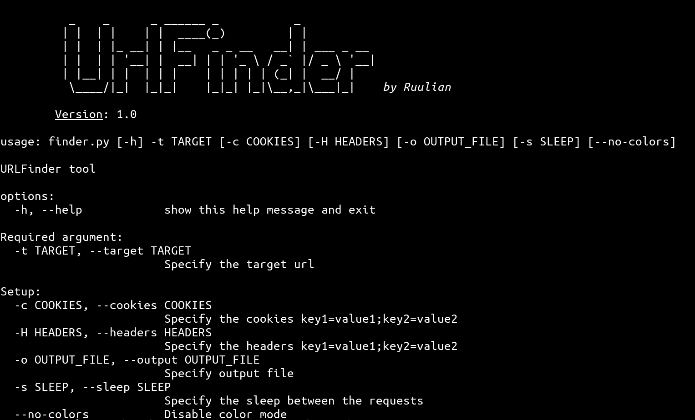

# URLFinder

## Description

URLFinder is a tool developed in Python by Ruulian which attempt to find all the urls which can be found on a website. It will curl all the pages found and do the process until it found all possible urls. You can combine this tool with others to complete your recon.

## Installation

```
git clone https://github.com/Ruulian/urlfinder.git
cd urlfinder/src
./finder.py -h
```

## Usage



## Example

```
ruulian@urlfinder-env:~$ ./finder.py -t https://0xhorizon.eu

          _    _      _ ______ _           _           
         | |  | |    | |  ____(_)         | |          
         | |  | |_ __| | |__   _ _ __   __| | ___ _ __ 
         | |  | | '__| |  __| | | '_ \ / _` |/ _ \ '__|
         | |__| | |  | | |    | | | | | (_| |  __/ |   
          \____/|_|  |_|_|    |_|_| |_|\__,_|\___|_|    by Ruulian

        Version: 1.0
        
==========================================================================
[STATUS_CODE] url
[200] https://0xhorizon.eu
[200] https://0xhorizon.eu/
[200] https://0xhorizon.eu/assets/images/logo_Horiz0nx.png
[200] https://0xhorizon.eu/index.xml
[200] https://0xhorizon.eu/index.json
[200] https://0xhorizon.eu/fr/
[200] https://0xhorizon.eu/assets/images/logo_thumbnail.png
[200] https://0xhorizon.eu/writeups/
[200] https://0xhorizon.eu/articles/
[200] https://0xhorizon.eu/cheat-sheet/
[200] https://0xhorizon.eu/search/
[200] https://0xhorizon.eu/articles/rsa/
[200] https://0xhorizon.eu/cheat-sheet/xss/
[200] https://0xhorizon.eu/articles/xss/
[200] https://0xhorizon.eu/articles/xss-stored/
[200] https://0xhorizon.eu/articles/xss-reflected/
[200] https://0xhorizon.eu/articles/xss-dom-based/
[200] https://0xhorizon.eu/writeups/bouncy-box/
[200] https://0xhorizon.eu/writeups/ssti/
[200] https://0xhorizon.eu/articles/http-response-splitting/
[200] https://0xhorizon.eu/writeups/cross_dungeon/
[200] https://0xhorizon.eu/writeups/fantasy_book/
[200] https://0xhorizon.eu/writeups/fantasy_gallery/
[200] https://0xhorizon.eu/writeups/my_first_treasure/
[200] https://0xhorizon.eu/writeups/quotehub/
[200] https://0xhorizon.eu/fr/index.xml
[200] https://0xhorizon.eu/fr/index.json
[200] https://0xhorizon.eu/fr/writeups/
[200] https://0xhorizon.eu/fr/articles/
[200] https://0xhorizon.eu/fr/cheat-sheet/
[200] https://0xhorizon.eu/fr/search/
[200] https://0xhorizon.eu/writeups/index.xml
[200] https://0xhorizon.eu/writeups/page/2/
[200] https://0xhorizon.eu/articles/index.xml
[200] https://0xhorizon.eu/articles/page/2/
[200] https://0xhorizon.eu/cheat-sheet/index.xml
[200] https://0xhorizon.eu/fr/articles/rsa/
[200] https://0xhorizon.eu/fr/cheat-sheet/xss/
[200] https://0xhorizon.eu/fr/articles/xss/
[200] https://0xhorizon.eu/fr/articles/xss-stored/
[200] https://0xhorizon.eu/fr/articles/xss-reflected/
[200] https://0xhorizon.eu/fr/articles/xss-dom-based/
[200] https://0xhorizon.eu/fr/writeups/bouncy-box/
[200] https://0xhorizon.eu/fr/writeups/ssti/
[200] https://0xhorizon.eu/fr/articles/http-response-splitting/
[200] https://0xhorizon.eu/fr/writeups/cross_dungeon/
[200] https://0xhorizon.eu/fr/writeups/fantasy_book/
[200] https://0xhorizon.eu/fr/writeups/fantasy_gallery/
[200] https://0xhorizon.eu/fr/writeups/my_first_treasure/
[200] https://0xhorizon.eu/fr/writeups/quotehub/
[200] https://0xhorizon.eu/fr/writeups/index.xml
[200] https://0xhorizon.eu/fr/writeups/page/2/
[200] https://0xhorizon.eu/fr/articles/index.xml
[200] https://0xhorizon.eu/fr/articles/page/2/
[200] https://0xhorizon.eu/fr/cheat-sheet/index.xml
==========================================================================
```